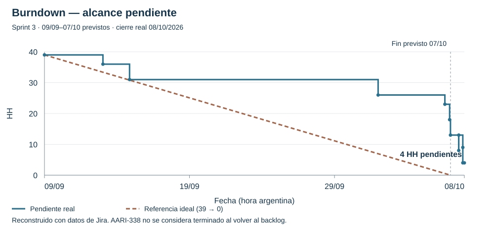
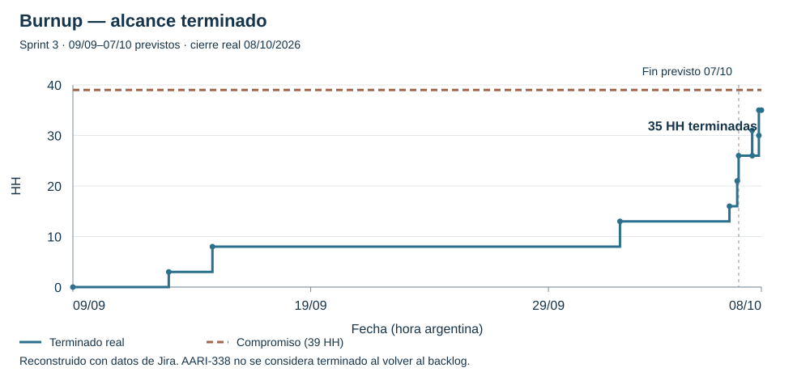
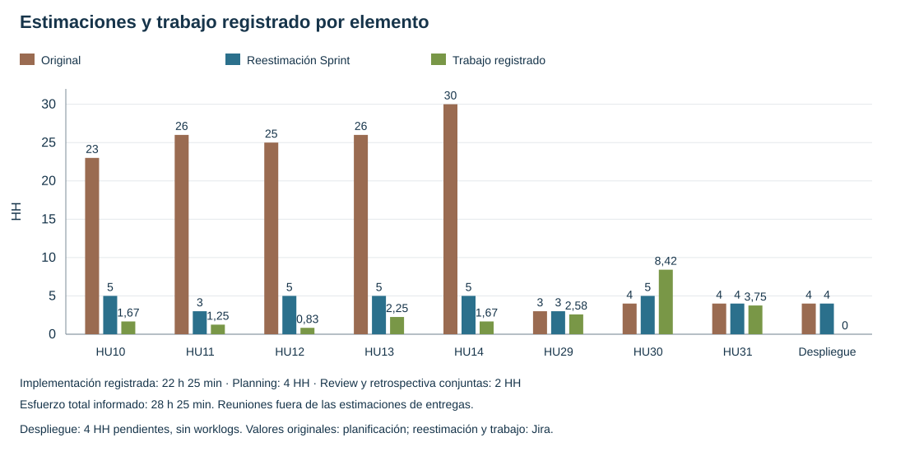

# AARI — Sprint 3: revisión del incremento y retrospectiva

Documento de trabajo elaborado el 08/10/2026 para revisar y consensuar entre ambos integrantes. El equipo informó una reunión conjunta de review y retrospectiva de 1 hora con ambos participantes, equivalente a 2 HH. Las acciones propuestas se conservan como borrador hasta consensuar el acta definitiva.

## 1. Período y cierre

El Sprint 3 se planificó para cuatro semanas, del **09/09 al 07/10/2026**. El 7 de octubre era la fecha prevista de finalización; el equipo informó que no pudo reunirse ese día. Las últimas verificaciones, correcciones y cierres administrativos se completaron el 8 de octubre.

Jira registra el cierre efectivo el **08/10/2026 a las 18:14, hora argentina**. Se mantienen ambas fechas explícitas, sin modificar retrospectivamente el historial. El despliegue AARI-338 permanece Por hacer, sin sprint activo o futuro asignado; se devuelve al Product Backlog para volver a priorizarlo en la siguiente planificación.

## 2. Sprint Review — resultado del incremento

### Objetivo y grado de cumplimiento

El objetivo era consolidar el flujo posterior al alta de un reclamo mediante contexto contractual revisado, trazabilidad, notificaciones, intervención humana en escalados y derivación de expensas, y disponer de un entorno compartido en la nube para validarlo y demostrarlo.

Se completaron y quedaron listas **las ocho historias comprometidas**. Sin embargo, el objetivo global se considera **parcialmente cumplido**, ya que el entorno compartido de despliegue no se entregó. Tener todas las HU funcionales terminadas no equivale a haber cumplido ese componente del Sprint Goal.

### Funcionalidades entregadas

- **HU29 — Gestión de contratos:** la inmobiliaria administra contratos, participantes, vigencia y versiones del PDF. Inquilinos y propietarios acceden a sus documentos según sus permisos. La firma permanece en el documento; no se agrega firma electrónica.
- **HU30 — Extracción y revisión contractual:** lectura de PDF/OCR, propuestas de cláusulas, revisión humana, historial y contexto contractual para reclamos. Se incorporó una alternativa local sin IA ante fallas del proveedor. Confirmar una propuesta no habilita automáticamente una regla decisoria: el uso en reclamos requiere revisión y activación explícitas. La alternativa local no debe presentarse como una interpretación jurídica automática.
- **HU10 — Actualizaciones del reclamo:** infraestructura y mensajes de notificación vinculados a cambios de estado.
- **HU11 — Historial por propiedad:** consulta de reclamos y trazabilidad del inmueble.
- **HU12 — Notificación al actor responsable:** integración del resultado de clasificación con el circuito de comunicación.
- **HU13 — Resolución de escalados:** cola y clasificación manual por inmobiliaria, con permisos y auditoría; clasificar no implica dar por terminada una reparación.
- **HU14 — Derivación de expensas:** reporte y seguimiento para intervención de la inmobiliaria, reutilizando la infraestructura de notificaciones.
- **HU31 — Inicio administrativo:** resumen operativo y accesos, navegación adaptada a escritorio/móvil, filtros de personas y propiedades, paginación, retorno al contexto del listado y acceso explícito a resolver clasificaciones.

### Alcance pendiente

**AARI-338 — Desplegar un entorno compartido de AARI en la nube**, con sus cinco subtareas, queda pendiente y vuelve al backlog. Conserva las **4 HH estimadas**. El tiempo registrado es cero; esto no constituye un ahorro de cuatro horas, sino trabajo no terminado. Las exploraciones previas de hosting no tienen un worklog específico en estos elementos y no se les atribuye tiempo inventado.

La selección del hosting debe resolver simultáneamente los requisitos acordados: sin pago ni tarjeta, soporte del backend y salida de correo, además de seguridad y configuración del entorno. La evaluación y aceptación del despliegue siguen pendientes.

## 3. Estimaciones y tiempo registrado

### Criterio de comparación

La planificación preservó **145 HH de estimación original**, con la convención académica de puntos equivalentes a HH, y una **reestimación de 39 HH** al comenzar Sprint 3. Se usa la reestimación para evaluar el compromiso vigente; no se cambian los valores después de conocer el resultado.

Las 39 HH se verificaron sumando las estimaciones originales de Time Tracking de las 71 subtareas. El tiempo real se obtuvo de los worklogs de las historias y subtareas, sumándolos una sola vez: no se vuelve a sumar el tiempo agregado del padre. Los 65 registros recuperados totalizan **22 h 25 min**.

| Elemento | Original | Sprint 3 | Real registrado | Resultado |
| --- | ---: | ---: | ---: | --- |
| HU29 / AARI-318 | 3 HH | 3 HH | 2 h 35 min | Lista |
| HU30 / AARI-319 | 4 HH | 5 HH | 8 h 25 min | Lista |
| HU10 / AARI-116 | 23 HH | 5 HH | 1 h 40 min | Lista |
| HU11 / AARI-125 | 26 HH | 3 HH | 1 h 15 min | Lista |
| HU12 / AARI-135 | 25 HH | 5 HH | 50 min | Lista |
| HU13 / AARI-147 | 26 HH | 5 HH | 2 h 15 min | Lista |
| HU14 / AARI-157 | 30 HH | 5 HH | 1 h 40 min | Lista |
| HU31 / AARI-332 | 4 HH | 4 HH | 3 h 45 min | Lista |
| Despliegue / AARI-338 | 4 HH | 4 HH | Sin tiempo registrado | Pendiente, backlog |
| **Total de entregas** | **145 HH** | **39 HH** | **22 h 25 min** | **8 HU listas; despliegue pendiente** |

**Planning:** el equipo confirmó una reunión de 2 horas con dos participantes: **4 HH**. Este dato se incorpora por separado, porque no se encontró una incidencia de planning con ese registro y no forma parte de las 39 HH estimadas para entregas. No se cargaron ni duplicaron worklogs en Jira durante la preparación de este informe.

**Review y retrospectiva:** el equipo confirmó una única reunión conjunta de 1 hora con dos participantes: **2 HH en total**, no 2 HH por ceremonia. Se incorpora como tiempo informado, separado de los worklogs de implementación; no se cargó en Jira durante esta actualización.

**Esfuerzo total informado del equipo: 28 h 25 min = 22 h 25 min de implementación registrada + 4 HH de planning + 2 HH de review y retrospectiva.** Las 6 HH de reuniones se informan por separado y no modifican la comparación de las entregas contra las 39 HH estimadas.

### Lectura de las diferencias

Las historias terminadas representan **35 de las 39 HH planificadas**: un cumplimiento ponderado del **89,7 %** del alcance. Por cantidad son **8 de 9 elementos**, o el **88,9 %**. Las ocho HU funcionales están terminadas; el noveno elemento es la tarea técnica de despliegue.

Sobre las entregas terminadas, 22 h 25 min registrados frente a 35 HH estimadas equivalen al **64,0 %** del esfuerzo previsto. La diferencia no debe interpretarse como productividad automática o ahorro seguro: los worklogs son tiempos informados por el equipo, no mediciones de un cronómetro, y no incluyen trabajo no registrado.

La reestimación mejoró respecto de los valores iniciales. HU29 quedó a 25 minutos de su estimación y HU31 a 15 minutos. HU30 excedió su previsión en **3 h 25 min, un 68,3 %**, por lo que la incertidumbre del circuito OCR/IA, sus validaciones y la recuperación ante fallas necesita un tratamiento especial. Varias historias de notificaciones e historial todavía tuvieron estimaciones muy superiores al tiempo informado.

En Sprint 2 se habían planificado 190 HH y registrado 22 h 20 min, según la planificación versionada de Sprint 3. La distancia entre estimación y registro se redujo, pero las funcionalidades y los criterios de registro no son idénticos entre sprints; no corresponde afirmar que la estimación ya es precisa en todas las categorías.

## 4. Interpretación de los gráficos

Datos de respaldo sin credenciales: [`datos.json`](datos.json). Los gráficos son estáticos y pueden verse directamente en GitHub.

Los gráficos adjuntos se **reconstruyen con datos reales de Jira** y no son capturas ni exportaciones de sus reportes nativos. Se recuperó el historial completo de estados y pertenencia al Sprint de los nueve elementos, además de estimaciones y worklogs. El peso de cada elemento es su reestimación al inicio, obtenida de sus subtareas.

### Burndown — alcance pendiente

Comienza en 39 HH y termina en 4 HH pendientes. La línea ideal es una referencia lineal hasta el 7 de octubre, no una predicción. El 7 de octubre, a la hora prevista de cierre, quedaban **13 HH de alcance todavía sin estado Listo**; el 8 de octubre quedaron cuatro tras finalizar los cierres de HU14, HU30 y HU31.

La curva incluye la reapertura de HU30 el 8 de octubre por el hotfix de reproducibilidad y su posterior cierre; no se borra esa oscilación para mejorar el gráfico. La devolución del despliegue al backlog al finalizar no se dibuja como si su trabajo hubiera sido completado.

### Burnup — alcance terminado frente al compromiso

El compromiso permanece en 39 HH y el terminado llega a 35 HH. La brecha de cuatro horas representa el despliegue pendiente. El 7 de octubre había 26 HH de alcance en Listo; el cierre administrativo posterior no se atribuye retroactivamente a ese día.

Ambas curvas usan **HH estimadas de alcance terminado o pendiente**, no horas consumidas ni estimación restante actualizada de cada subtarea. No sustituyen un burndown de Time Tracking. El historial de los nueve padres no registra altas o bajas de alcance durante la ejecución; los cambios de filtros y recuperación contractual ampliaron el contenido de HU existentes sin modificar sus estimaciones.

### Comparación de estimaciones

Muestra por elemento las tres medidas: estimación inicial, reestimación del Sprint y tiempo registrado. Los valores iniciales provienen de la planificación versionada; el campo de puntos de los padres consultados está vacío, por lo que no se atribuyen esos números a un gráfico nativo de puntos de Jira. Planning, review y retrospectiva se informan aparte, sin asignarles una estimación no acordada.

### Señales de concentración del cierre

Cinco de las ocho HU tienen su último cierre administrativo el 7 u 8 de octubre (**62,5 %**). Además, **11 h 50 min de los 22 h 25 min registrados —52,8 %—** tienen fecha de trabajo entre el 2 y el 8 de octubre. Esto respalda la necesidad de distribuir el esfuerzo y la integración. No prueba que todas esas funcionalidades se hayan desarrollado recién esos días: los estados pueden actualizarse después del desarrollo.

## 5. Sprint Retrospective — aprendizaje del equipo

### Qué mejoró respecto del Sprint anterior

1. **Estimaciones basadas en evidencia.** Se utilizó la duración real del Sprint 2 para ajustar el compromiso, en lugar de seguir con valores iniciales muy alejados del trabajo observado. HU29 y HU31 muestran una aproximación especialmente buena.
2. **Registro y trazabilidad de horas.** Los worklogs permiten recuperar el tiempo por historia y, en varias HU, por subtarea. Se verificó el total sin duplicar padres y subtareas. Planning se identifica como trabajo del equipo y se expresa en HH.
3. **Revisión e integración.** Se mantuvieron PR separados por historia, revisión cruzada, correcciones y verificaciones antes del merge. Se atendieron problemas de concurrencia, fechas, dependencias y retorno desde listados, sin regenerar evidencias históricas para ocultar fallos.
4. **Calidad y documentación.** Se conservaron decisiones y resultados en el repositorio cuando Notion alcanzó su límite. Se distinguieron pruebas simuladas, validaciones externas y límites de los entornos de revisión.

### Qué debemos mejorar

1. **No relegar el proyecto hasta la última semana.** El equipo reconoce que se dejó acumular trabajo y revisiones. Necesitamos darle prioridad sostenida, no depender de sesiones extensas justo antes del cierre.
2. **Reservar tiempo diario incluso durante parciales.** Organizar anticipadamente los bloques de proyecto y estudio, manteniendo un mínimo diario protegido para AARI en lugar de suspenderlo por completo hasta terminar los exámenes.
3. **Destrabar dependencias externas antes.** No permitir que fallas o límites de un proveedor de IA consuman semanas sin una alternativa operativa y un límite de intentos acordado. Separar días de espera de HH efectivamente trabajadas.
4. **Preparar el despliegue desde el inicio.** La investigación del servicio debe ocurrir en paralelo a las HU. Dejarla para el final impide verificar un componente explícito del Sprint Goal.
5. **Cerrar y revisar en forma continua.** Actualizar Jira y revisar los PR durante todo el sprint, para que los gráficos reflejen la evolución y no solo cierres administrativos acumulados.
6. **Ajustar estimaciones por tipo de trabajo.** Usar referencias distintas para CRUD conocido, integración/reutilización y experimentación OCR/IA. Estimar también validaciones y contingencias, sin inflar todo de la misma manera.

### Acciones propuestas para el próximo Sprint

Estas acciones son propuestas para consensuar como acuerdos del acta definitiva; no se afirma que ya se hayan ejecutado.

| Acción | Responsabilidad | Seguimiento propuesto |
| --- | --- | --- |
| Reservar un bloque diario de 30–45 minutos por integrante, compatible con la capacidad real | Ambos | Revisar al final de cada semana cuántos bloques se cumplieron y ajustar el compromiso si hace falta |
| Registrar al final de cada jornada el trabajo y el bloqueo principal | Ambos | Worklogs del día y estado actualizados; separar horas de reunión de HH |
| Revisar PR dentro del siguiente día de trabajo disponible | Revisor de cada entrega | Si no puede revisar, avisar y pactar una fecha, sin acumularlos al cierre |
| Definir alternativa o reducción segura de alcance cuando un bloqueo externo consume dos bloques de trabajo sin progreso | Ambos | Registrar intentos, diagnóstico, límite acordado y decisión; no insistir indefinidamente |
| Volver a priorizar AARI-338 antes de iniciar el próximo compromiso | Ambos | Acordar servicio viable y primera prueba de despliegue temprana; no darlo por terminado por haber investigado hosting |
| Separar en planning desarrollo, pruebas, integración, revisiones y reuniones | Ambos | Mantener una base de comparación clara y revisar diferencias por categoría |
| Reservar los últimos dos días planificados para integración, demostración y cierre | Ambos | Evitar iniciar en ese margen funcionalidades nuevas salvo replanificación explícita |

## 6. Conclusión de la revisión

El Sprint 3 consolidó las ocho historias funcionales y mejoró la base de estimación y trazabilidad respecto del Sprint anterior. El incremento integra contratos, contexto revisado, comunicaciones, trazabilidad e intervención operativa. La entrega no está completa en cuanto al entorno compartido en la nube: AARI-338 permanece pendiente.

El principal aprendizaje organizativo es sostener el proyecto diariamente y anticipar revisiones, pruebas externas y despliegue. La mejora de estimaciones se mantiene como un avance real, pero la variación de HU30 muestra que debemos tratar por separado la incertidumbre experimental. El próximo compromiso debe considerar tanto el alcance pendiente como el tiempo de reuniones, validación e integración.

## 7. Fuentes y límites de verificación

- [Planificación versionada de Sprint 3](https://github.com/TaliaZurbriggen/Proyecto-Final-AARI/blob/40d9c865c1aaee53f16834fd8e733ba2a52918c2/docs/planificacion_sprint_3.md): objetivo, estimaciones iniciales/reestimadas, distribución y referencia de Sprint 2.
- Jira, Sprint 3, ID 39 y tablero 3: consulta de los nueve elementos, sus 71 subtareas, el historial completo recuperado de los padres y 65 worklogs. La suma de worklogs coincide con los agregados de las HU.
- [Despliegue AARI-338](https://taliazurbriggen.atlassian.net/browse/AARI-338): pendiente y sin sprint activo/futuro después del cierre.
- [PR #31](https://github.com/TaliaZurbriggen/Proyecto-Final-AARI/pull/31): integración final de HU31 y hotfix HU30; merge `40d9c86` el 08/10.
- Las 4 HH de planning, las 2 HH conjuntas de review y retrospectiva y los puntos de mejora organizativa fueron informados por el equipo en esta conversación. Los tiempos de reuniones se incorporan al informe, sin generar worklogs en Jira.
- No se ejecutaron nuevas pruebas del producto ni llamadas a Gemini, Supabase o SMTP para preparar la review. No se modificaron horas, estimaciones ni estados de incidencias. El cierre del Sprint fue realizado por la persona usuaria y verificado por consulta posterior.
- No se obtuvieron capturas de los gráficos nativos: Chrome no estaba disponible para controlarlo. Las curvas reconstruidas están identificadas como tales; no se presentan como reportes exportados por Jira.
- La publicación de este borrador fue autorizada el 08/10 en la rama `codex/sprint-3-cierre-sprint-4`, para comparación y revisión mediante PR. No se publicó en Notion; el acta definitiva requiere acuerdo del equipo.

### Texto breve sugerido para la fecha del informe

El Sprint 3 tenía como fecha prevista de finalización el 7 de octubre. Al no poder reunirnos ese día, completamos las verificaciones y el cierre administrativo en Jira el 8 de octubre. La review y la retrospectiva se realizaron en una reunión conjunta de 1 hora entre ambos integrantes, equivalente a 2 HH.
